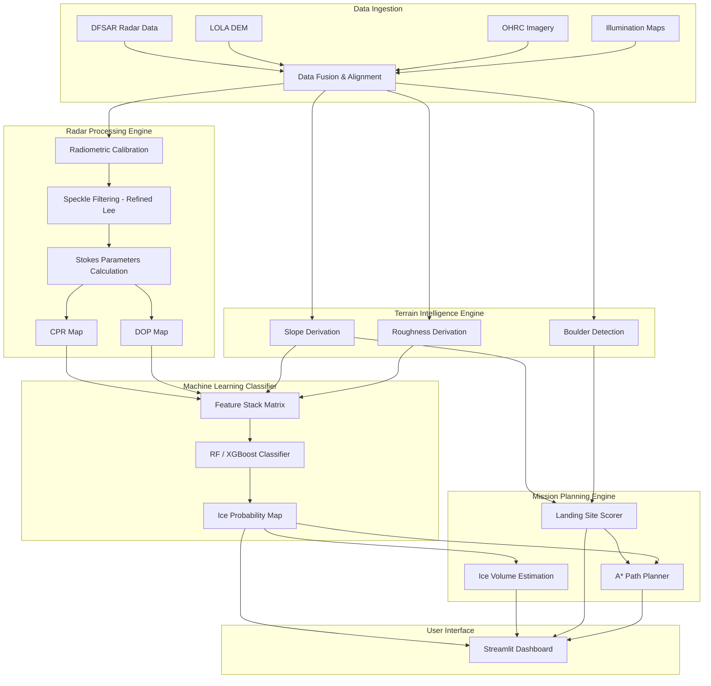

# System Architecture

LunaIceNet is designed as a modular, end-to-end data processing and decision-support pipeline. The architecture is divided into specialized modules that handle specific tasks, flowing from raw satellite data to an interactive mission planning dashboard.

## High-Level Architecture Diagram

## Module Breakdown

### 1. Data Ingestion & Co-registration Layer
- **Function**: Reads diverse file formats (PDS4, GeoTIFF), aligns them to a common Polar Stereographic projection, and resamples them to a uniform spatial resolution.
- **Core Tech**: `GDAL`, `rasterio`.

### 2. Radar Processing Engine
- **Function**: Transforms raw polarimetric SAR data into physical scattering metrics.
- **Process**:
  - Calibrates Digital Numbers to Sigma-0 (σ⁰) backscatter.
  - Applies Refined Lee filtering to reduce speckle noise without destroying sharp terrain edges.
  - Computes the four Stokes vectors, from which CPR (Circular Polarization Ratio) and DOP (Degree of Polarization) are derived.
- **Core Tech**: `NumPy`, `SciPy`, `MIDAS` routines.

### 3. Terrain Intelligence Engine
- **Function**: Extracts geomorphological context from DEMs and optical data.
- **Process**:
  - Calculates gradient (Slope) and standard deviation of elevation (Roughness) from the LOLA DEM.
  - Uses computer vision on OHRC imagery to identify boulder fields and crater hazards.
- **Core Tech**: `NumPy`, `OpenCV`, `QGIS` processing algorithms.

### 4. ML Classification Engine
- **Function**: Merges radar and terrain features to classify pixels and eliminate false positives (e.g., radar-bright rocks).
- **Process**:
  - Stacks features: [CPR, DOP, σ⁰, Slope, Roughness, Illumination].
  - Evaluates via a trained Random Forest or XGBoost model.
  - Outputs a floating-point probability map (0.0 to 1.0) indicating the likelihood of subsurface ice.
- **Core Tech**: `scikit-learn`, `xgboost`.

### 5. Mission Planning Engine
- **Function**: Translates scientific maps into actionable engineering plans.
- **Process**:
  - **Volume Estimation**: Integrates the probability map over area and assumed depth to calculate expected ice yields with uncertainty bounds.
  - **Landing Site Selection**: Evaluates non-PSR areas for safety based on slope thresholds, illumination availability, and low hazard density.
  - **Rover Traverse Planner**: Uses A* algorithms on a customized cost-grid (penalizing steep slopes and deep shadows) to find the safest and shortest route from the landing site to the target ice deposit.
- **Core Tech**: `NetworkX`, `SciPy` optimization.

### 6. Presentation Layer (Dashboard)
- **Function**: Provides an interactive interface for scientists and mission planners.
- **Core Tech**: `Streamlit`, `Matplotlib`, `Folium` (for map rendering).
